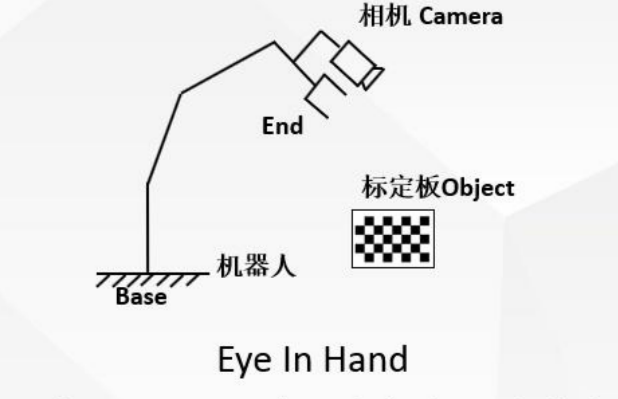
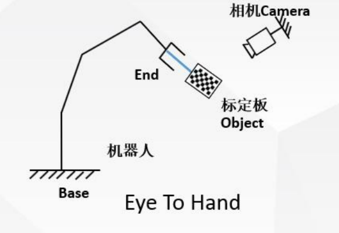

$T_a^b$ 表示从 $a$ 坐标系到 $b$ 坐标系的位姿变换矩阵。

# 1.眼在手上

目标：求相机坐标系到机械臂末端坐标系的位姿变换关系。

示意图如下：



在这种情况下，Base坐标系不变，标定板位置不变，相机与机械臂末端的相对位姿不变。

对于机器人移动过程中的任意两个位姿，有以下公式成立：
$$
T_{End}^{Base}\cdot T_{Cam}^{End}\cdot T_{Target}^{Cam} = T_{Target}^{Base}
$$
其中，相机到机械臂末端的关系保持不变，记为$$T_{Cam}^{End}$$，标定板到机械臂底座的关系保持不变，记为$$T_{Target}^{Base}$$。改变机械臂的姿态，有：
$$
\begin{aligned}
T1_{End}^{Base}\cdot T_{Cam}^{End}\cdot T1_{Target}^{Cam} = T_{Target}^{Base} \\
T2_{End}^{Base}\cdot T_{Cam}^{End}\cdot T2_{Target}^{Cam} = T_{Target}^{Base}
\end{aligned}
$$
联立两公式，得：
$$
\left(T2_{End}^{Base}\right)^{-1}\cdot T1_{End}^{Base}\cdot T_{Cam}^{End} = T_{Cam}^{End}\cdot T2_{Target}^{Cam}\cdot \left(T1_{Target}^{Cam}\right)^{-1}
$$
令：
$$
\begin{aligned}
A &= \left(T2_{End}^{Base}\right)^{-1}\cdot T1_{End}^{Base} \\
B &= T2_{Target}^{Cam}\cdot \left(T1_{Target}^{Cam}\right)^{-1} \\
X &= T_{Cam}^{End}
\end{aligned}
$$
上式化为 $A\cdot X = X\cdot B$ 的形式。


# 2.眼固定

目标：求相机坐标系到机械臂基坐标系的位姿变换关系。

示意图如下：



在这种情况下，Base坐标系不变，相机位置不变，标定板与机械臂末端的相对位姿不变。

对于机器人移动过程中的任意两个位姿，有以下公式成立：
$$
T_{Base}^{End}\cdot T_{Cam}^{Base}\cdot T_{Target}^{Cam} = T_{Target}^{End}
$$
其中，相机到机械臂底座的关系保持不变，记为$$T_{Cam}^{Base}$$，标定板到机械臂末端的关系保持不变，记为$$T_{Target}^{End}$$。改变机械臂的姿态，有：
$$
\begin{aligned}
T1_{Base}^{End}\cdot T_{Cam}^{Base}\cdot T1_{Target}^{Cam} = T_{Target}^{End} \\
T2_{Base}^{End}\cdot T_{Cam}^{Base}\cdot T2_{Target}^{Cam} = T_{Target}^{End}
\end{aligned}
$$


联立两公式，有：
$$
\left(T2_{Base}^{End}\right)^{-1}\cdot T1_{Base}^{End}\cdot T_{Cam}^{Base} = T_{Cam}^{Base}\cdot T2_{Target}^{Cam}\cdot\left(T1_{Target}^{Cam}\right)^{-1}
$$
令：
$$
\begin{aligned}
A &= \left(T2_{Base}^{End}\right)^{-1}\cdot T1_{Base}^{End} \\
B &= T2_{Target}^{Cam}\cdot\left(T1_{Target}^{Cam}\right)^{-1} \\
X &= T_{Cam}^{Base}
\end{aligned}
$$
上式化为 $A\cdot X = X\cdot B$ 的形式。

# 3.求解AX = XB

这里介绍两种方法，都是采用两步法，把 $A\cdot X = X\cdot B$ 问题转换成最小二乘拟合问题。

先展开写成矩阵形式：
$$
\left[\begin{array}{{20}{c}} R_A & t_A \\ 0 & 1 \end{array} \right]
\left[\begin{array}{{20}{c}} R_X & t_X \\ 0 & 1 \end{array} \right] = 
\left[\begin{array}{{20}{c}} R_X & t_X \\ 0 & 1 \end{array} \right]
\left[\begin{array}{{20}{c}} R_B & t_B \\ 0 & 1 \end{array} \right]
$$


展开得到：
$$
\begin{aligned}
R_A\cdot R_X &= R_X\cdot R_B \\
R_A\cdot t_X + t_A &= R_X\cdot t_B + t_X
\end{aligned}
$$
先求旋转矩阵，再求平移向量。

## 3.1 求解旋转矩阵

### 3.1.1 方法一

采用李群理论，这里 ${R_A,R_B,R_X}\in SO3$，变换可得：
$$
\begin{aligned}
R_A &= R_X\cdot R_B\cdot R_X^T \\
ln\left(R_A\right) &= ln\left(R_X\cdot R_B\cdot R_X^T\right)
\end{aligned}
$$
当 $R_B$ 没有没有落在负实轴上的特征值（对于旋转矩阵来说就是$\theta\notin \{0,\pi\}$，更严格为$\theta\in(0,\pi)$）。有：
$$
ln\left(R_A\right) = R_X\cdot ln\left(R_B\right)\cdot R_X^T
$$
令 $ln\left(R_A\right) = a^\wedge,ln\left(R_B\right) = b^\wedge$（对数映射成李代数），有：
$$
\begin{aligned}
a^\wedge &= R_X\cdot b^\wedge\cdot R_X^T \\
a^\wedge &= \left(R_X\cdot b\right)^\wedge \\
a &= R_X\cdot b
\end{aligned}
$$
当存在 $k$ 组观测时，求解该方程可以转换为如下最小二乘拟合问题：
$$
\min\sum_{i=1}^{k}||R_X\cdot b - a||^2
$$
该问题是绝对定向问题，解为：
$$
R_X = \left(M^TM\right)^{-\frac{1}{2}}M^T \quad M = \sum_{i=1}^{k}b_i\cdot a_i^T
$$
上述求解是有条件的，即 $M$ 不奇异。

### 3.1.2 方法二

采用量化算子求解方程的方法，先介绍几个基本概念：

- 矩阵向量化 $vec(A)$：若 A 是 $m\times n$ 矩阵，则 $vec(A) = [a_{11},a_{12},...,a_{21},a_{22},...,a_{mn}]$。逐行拼接。
- 矩阵 A 和 B 的 $Kronecker$ 积$A\otimes B$：A 中每个元素 $a_{ij}$ 与 B 相乘作为大矩阵中的一块，如下。

$$
\left[{\begin{array}{{20}{c}}
a_{11}B & a_{12}B & \cdots & a_{1n}B \\
a_{21}B & a_{22}B & \cdots & a_{2n}B \\
\vdots & \vdots & \ddots & \vdots \\
a_{m1}B & a_{m2}B & \cdots &a_{mn}B
\end{array}} \right]
$$

- 对于矩阵 $A_{m\times p},B_{p\times q},C_{q\times n}$，有 $vec(ABC) = (A\otimes C^T)\cdot vec(B)$。

将 $R_A\cdot R_X = R_X\cdot R_B$ 写成 $R_A\cdot R_X\cdot I = I\cdot R_X\cdot R_B$ 两边同时 $vec$ 向量化。有：
$$
\begin{aligned}
vec(R_A\cdot R_X\cdot I) &= vec(I\cdot R_X\cdot R_B) \\
\left(R_A\otimes I^T\right)\cdot vec(R_X) &= \left(I\otimes R_B^T\right)\cdot vec(R_X) \\
\left(R_A\otimes I - I\otimes R_B^T\right)\cdot vec(R_X) &= 0 \\
S\cdot vec(R_X) &= 0
\end{aligned}
$$
其中 $S = R_A\otimes I - I\otimes R_B^T$。上述方程转换为一个齐次线性方程，可以用最小二乘法进行求解。

对矩阵 $S$ 进行SVD分解得到 $S = U_S*\Sigma_S*V_S^T$，该齐次线性方程的解为 $V_S$ 的最后一列。

将 $vec(R_X)$ 还原回矩阵形式得到 $R_X^*$，因为旋转矩阵满足正交性，$R_X^*$ 不一定是正交矩阵。

对 $R_X^*$ 进行SVD分解得到 $R_X^* = U_X*\Sigma_X*V_X^T$，取 $R_X = U_X*V_X^T$ 作为最终结果。

$\Sigma_X$ 在一定程度上可以反映标定结果的好坏，良好的标定其 $\Sigma_X$ 的对角元素应该非常接近甚至完全相等。

## 3.2求解平移矩阵

将 $R_X$ 代入 $R_A\cdot t_X + t_A = R_X\cdot t_B + t_X$，可得：
$$
\left(R_A - I\right)\cdot t_X = R_X\cdot t_B - t_A
$$
同样使用最小二乘求解。

# 4.opencv函数

除了上述方法外，opencv里也提供了用于求解手眼标定的函数，以c++为例（python当然也可以），求解方法设为tsai-lenz方法（opencv提供是改良后的版本）为例，函数原型为：

```c++
void cv::calibrateHandEye(
    InputArrayOfArrays R_gripper2base,
    InputArrayOfArrays t_gripper2base,
    InputArrayOfArrays R_target2cam,
    InputArrayOfArrays t_target2cam,
    OutputArray R_cam2gripper,
    OutputArray t_cam2gripper,
    HandEyeCalibrationMethod method = CALIB_HAND_EYE_TSAI
);

```

这个函数只解决眼在手上（eye-in-hand）的问题，如下：

- 输入R_gripper2base，t_gripper2base是 $T_{End}^{Base}$ 的旋转平移。
- 输入R_target2cam，t_target2cam,是 $T_{Target}^{Cam}$ 的旋转平移。
- 输出R_cam2gripper，t_cam2gripper是 $T_{Cam}^{End}$ 的旋转平移。

如果想用于眼固定（eye-to-hand），要修改输入方式，如下：

- 输入R_gripper2base，t_gripper2base是 $T_{Base}^{end}$ 的旋转平移。
- 输入R_target2cam，t_target2cam,是 $T_{Target}^{Cam}$ 的旋转平移。
- 输出R_cam2gripper，t_cam2gripper是 $T_{Cam}^{Base}$ 的旋转平移。
